Session1: Data summary
========================================================
author: MRC Clinical Sciences Centre (http://mrccsc.github.io/)
date: 14/Nov/2016
width: 1440
height: 1100
autosize: true
font-import: <link href='http://fonts.googleapis.com/css?family=Slabo+27px' rel='stylesheet' type='text/css'>
font-family: 'Slabo 27px', serif;
css:style.css

Outline
========================================================

- Session1: data summary

- Session2: hypothesis testing and ANOVA

- Session3: correlation and linear regression

Materials.
========================================================
id: materials

All prerequisites, links to material and slides for this course can be found on github.
* [StatisticsInR](http://mrccsc.github.io/StatisticsInR/)

Or can be downloaded as a zip archive from here.
* [Download zip](https://github.com/mrccsc/StatisticsInR/zipball/master)

Materials. - Presentations, source code and practicals.
========================================================

Once the zip file in unarchived. All presentations as HTML slides and pages, their R code and HTML practical sheets will be available in the directories underneath.

* **exercises/**
Practicals as HTML pages.
* **answers/**
Practicals with answers as HTML pages and R code solutions.

Set the Working directory
========================================================

Before running any of the code in the practicals or slides we need to set the working directory to the folder we unarchived.

You may navigate to the unarchived Reproducible-R folder in the Rstudio menu

**Session -> Set Working Directory -> Choose Directory**

or in the console.


```r
setwd("/CSC/workshop/StatisticsInR/Statistics2016")
# e.g. setwd("~/Downloads/StatisticsInR/Statistics2016")
```

Session1 - data summary
========================================================

- data type

- spread of data

- shape of data

- distribution


Data type
========================================================

data type

- continuous

eg. blood pressure, body weight, height ...

- discrete

eg. gender, hair colour, RNA-seq read count...


Spread of data - Life expectancy example
========================================================
Life expectancies at Birth for the UK and Constituent Countries 1991-93 to 2010-12

Data Source: Office for National Statistics

Load data

```r
> Life_exp<-read.csv("data/Life_expectancy_at_birth.csv",header=T)
```

Recap some basic R functions (1/6)
========================================================
- **str()**, **head()**, **dim()**, **colnames()** and **summary()** functions
- more details please see [Reproducible R course](http://mrccsc.github.io/Reproducible-R/)

-- [Data types in R](http://mrccsc.github.io/Reproducible-R/r_course/presentations/slides/introToR_Session1.html#/datatypes)


Recap some basic R functions (2/6)
========================================================

**head()**: See the first 6 lines of an R object

```r
> head(Life_exp)
```

```
       time    area life.expectancy gender
1 1991-1993 England           73.69  Males
2 1992-1994 England           74.02  Males
3 1993-1995 England           74.18  Males
4 1994-1996 England           74.44  Males
5 1995-1997 England           74.61  Males
6 1996-1998 England           74.84  Males
```

Recap some basic R functions (3/6)
========================================================

**str()**: Compactly display the internal structure of an R object

```r
> str(Life_exp)
```

```
'data.frame':	160 obs. of  4 variables:
 $ time           : Factor w/ 20 levels "1991-1993","1992-1994",..: 1 2 3 4 5 6 7 8 9 10 ...
 $ area           : Factor w/ 4 levels "England","N.Ireland",..: 1 1 1 1 1 1 1 1 1 1 ...
 $ life.expectancy: num  73.7 74 74.2 74.4 74.6 ...
 $ gender         : Factor w/ 2 levels "Females","Males": 2 2 2 2 2 2 2 2 2 2 ...
```

Recap some basic R functions (4/6)
========================================================
see the how many rows and columns in "Life_exp"

```r
> dim(Life_exp)
```

```
[1] 160   4
```

see column names of "Life_exp"

```r
> colnames(Life_exp)
```

```
[1] "time"            "area"            "life.expectancy" "gender"         
```

Recap some basic R functions (5/6)
========================================================


```r
> summary(Life_exp)
```

```
        time            area    life.expectancy     gender  
 1991-1993:  8   England  :40   Min.   :71.47   Females:80  
 1992-1994:  8   N.Ireland:40   1st Qu.:75.08   Males  :80  
 1993-1995:  8   Scotland :40   Median :78.00               
 1994-1996:  8   Wales    :40   Mean   :77.63               
 1995-1997:  8                  3rd Qu.:79.91               
 1996-1998:  8                  Max.   :83.01               
 (Other)  :112                                              
```

Recap some basic R functions (6/6)
========================================================

**ftable()**: Create ‘flat’ contingency tables

```r
ftable(Life_exp[,c("area","gender")])
```

```
          gender Females Males
area                          
England               20    20
N.Ireland             20    20
Scotland              20    20
Wales                 20    20
```

Spread of data - use "Life_exp$life.expectancy" (1/9)
========================================================

- working with plots
- more details please see [Reproducible R course](http://mrccsc.github.io/Reproducible-R/)

--[Plotting in R](http://mrccsc.github.io/Reproducible-R/r_course/presentations/slides/introToR_Session1.html#/plotting)


Spread of data - work with plots (2/9)
========================================================

Scatter plot: plot the life.expectancy against index


```r
> plot(Life_exp$life.expectancy,ylab="Life expectancy (Years)")
```

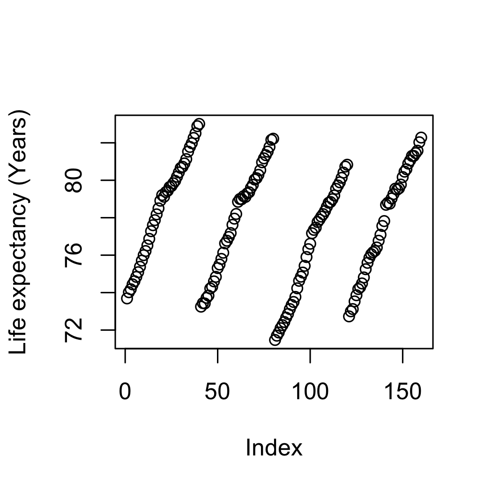

Spread of data - work with plots (3/9)
========================================================
sort the data from min to max

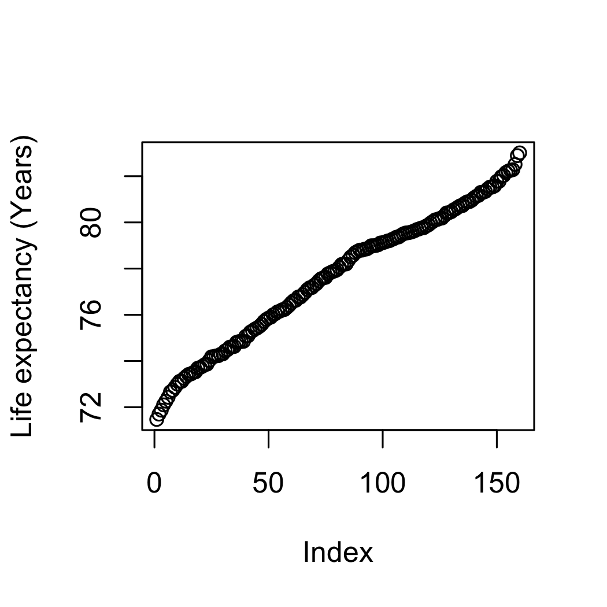
***

start to see something here...

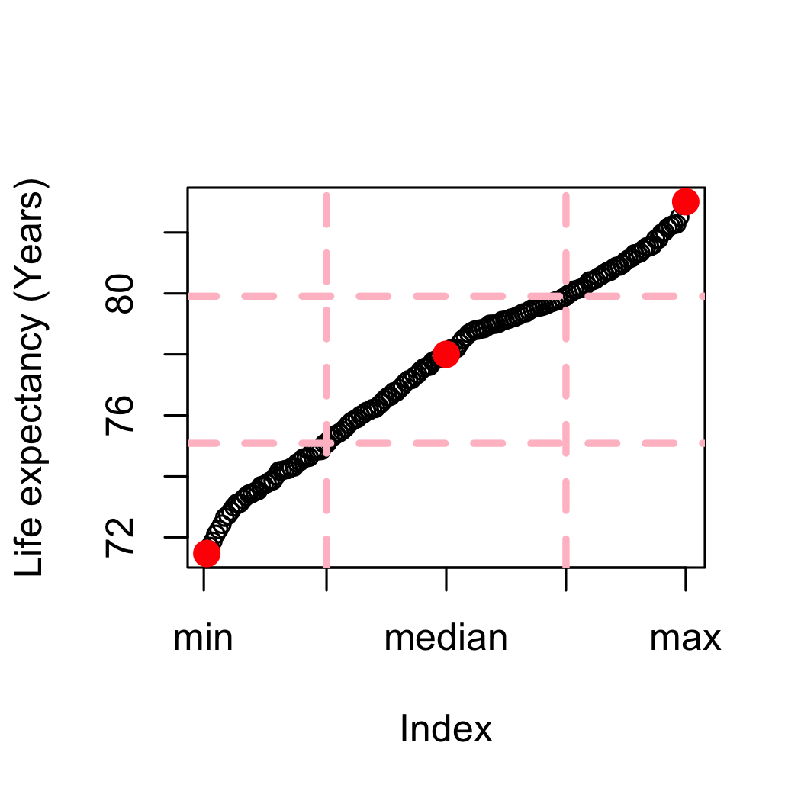

Spread of data - work with plots (4/9)
========================================================

**min()**, **max()**, **median()**, **range()** and **quantile()** functions

```r
> min.life.exp<-min(Life_exp$life.expectancy)
> max.life.exp<-max(Life_exp$life.expectancy)
> median.life.exp<-median(Life_exp$life.expectancy)
> mean.life.exp<-mean(Life_exp$life.expectancy)
> c(min.life.exp, max.life.exp, median.life.exp, mean.life.exp)
```

```
[1] 71.47000 83.01000 78.00500 77.62506
```

```r
> range(Life_exp$life.expectancy)
```

```
[1] 71.47 83.01
```

```r
> quantile(Life_exp$life.expectancy)
```

```
    0%    25%    50%    75%   100% 
71.470 75.085 78.005 79.910 83.010 
```

Spread of data - work with plots (5/9)
========================================================
Left: 40%

Boxplot

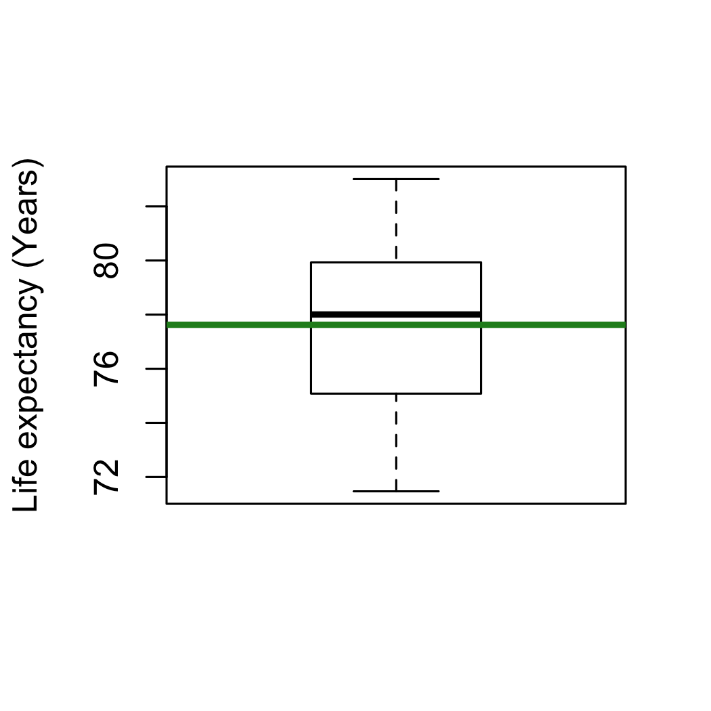
***

```r
> c(min.life.exp, max.life.exp)
```

```
[1] 71.47 83.01
```

```r
> c(median.life.exp, mean.life.exp)
```

```
[1] 78.00500 77.62506
```

```r
> quantile(Life_exp$life.expectancy)[c(2,4)]
```

```
   25%    75% 
75.085 79.910 
```


Spread of data - work with plots (6/9)
========================================================

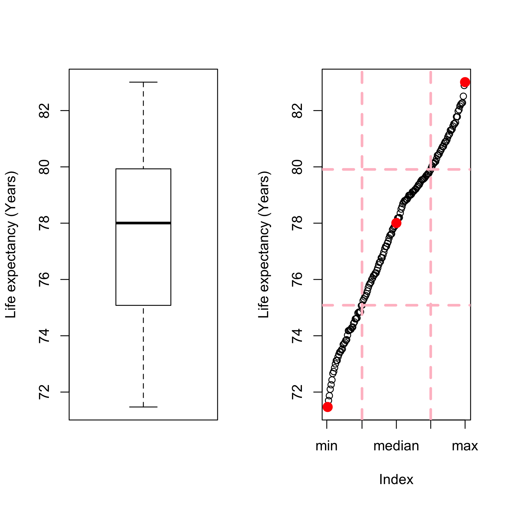

Spread of data -  work with plots (7/9)
========================================================
**summary()**

```r
> summary(Life_exp$life.expectancy)
```

```
   Min. 1st Qu.  Median    Mean 3rd Qu.    Max. 
  71.47   75.09   78.00   77.63   79.91   83.01 
```
**range()**: show the minimum and maximum

```r
> range(Life_exp$life.expectancy)
```

```
[1] 71.47 83.01
```
**IQR()**: show the interquartile range, i.e. 3rd quartile - 1st quartile

```r
> IQR(Life_exp$life.expectancy)
```

```
[1] 4.825
```

Spread of data - Variance and Standard deviation (8/9)
========================================================

$$
  \begin{aligned}
  \overline x  = \frac{{\displaystyle\sum_{i=1}^n}x_i}n \\
  \\ \\
  \text{Variance} = \sigma^2 = \frac{{\displaystyle\sum_{i=1}^n}(\left|x_i-\overline x\right|)^2}{n-1} \\
  \\ \\
  \text{Standard deviation} = \sigma =\sqrt{\text{Variance}} \\
  \\ \\
  \end{aligned}
$$

```r
> var.life.exp<-sum((Life_exp$life.expectancy-mean.life.exp)^2)/(nrow(Life_exp)-1)
> sd.life.exp<-sqrt(var.life.exp)
> c(var.life.exp, sd.life.exp)
```

```
[1] 8.653772 2.941729
```

Spread of data - var() and sd() function (9/9)
========================================================

```r
> var(Life_exp$life.expectancy)
```

```
[1] 8.653772
```

```r
> sd(Life_exp$life.expectancy)
```

```
[1] 2.941729
```


Data shape - histogram (1/4)
========================================================


```r
> hist(Life_exp$life.expectancy,breaks=10)
```

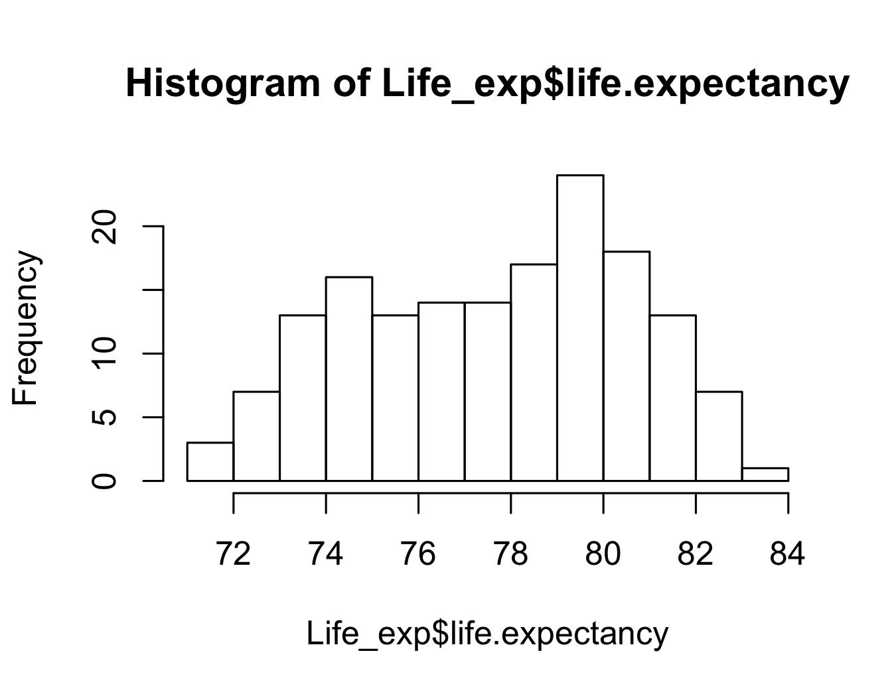

Data shape - histogram (2/4)
========================================================


```r
> hist(Life_exp$life.expectancy,breaks=10,freq = F)
> lines(density(Life_exp$life.expectancy),col="red")
```

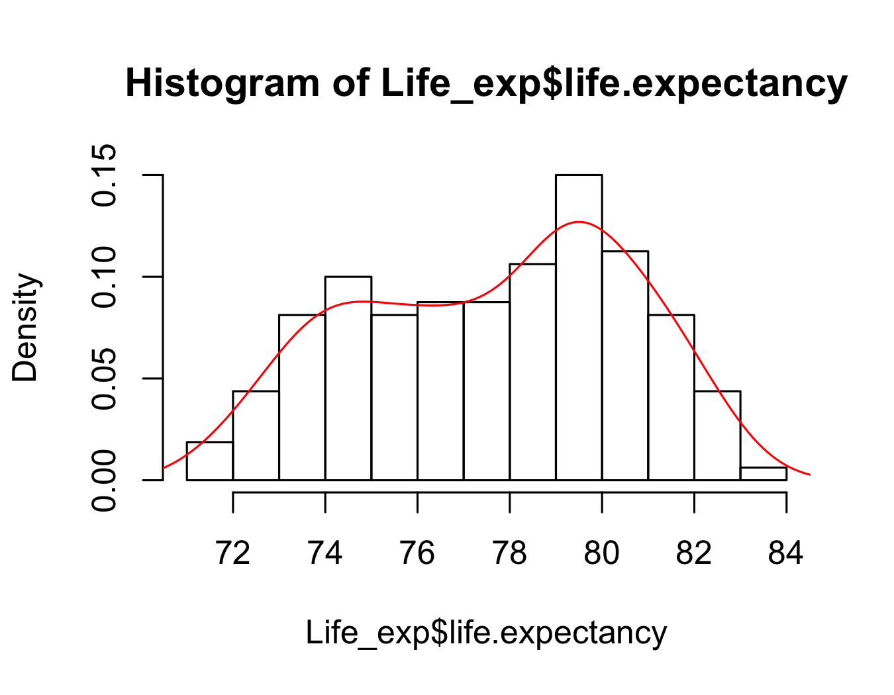

Data shape - histogram (3/4)
========================================================


Data shape - violin plot (4/4)
========================================================
Left: 40%

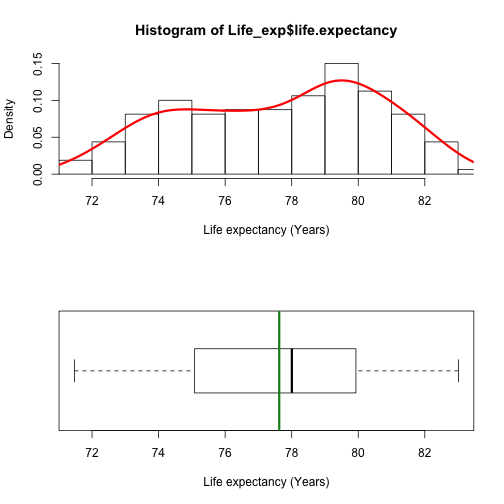
***


```r
#install.packages("vioplot")
library("vioplot")
```

```r
> vioplot(Life_exp$life.expectancy,
+         ylim=range(Life_exp$life.expectancy),
+         horizontal = T)
```


Distributions (1/6)
========================================================
- Binomial distribution
- Normal distribution


Distributions (2/6)
========================================================
R comes with functions for extracting information from most common distibutions types. An example of standard R functions for dealing with distibution can be seen here using the normal distributions.

- pnorm - cumulative distribution for x, aka c.d.f. (cumulative distribution function)
- qnorm - inverse of pnorm (from probability gives x)
- dnorm - distribution density, aka p.d.f. (probability density function)
- rnorm - random number from normal distribution

Distributions (3/6)
========================================================
Similar functions are available for other distibution types including:

- pbinom (binomial)
- pt (T distribution)
- pnbinom (negative binomial),
- phyper (hypergeometric)


Binomial distribution (4/6)
========================================================

$$X \sim Binom(n,p)$$

$$
n=\text{number of experiment}
\\
p=\text{probability of success}
$$

$$
E(X)=np
\\
Var(X)=\frac{p(1-p)}n
\\
$$

For example:

$$X \sim B(100,0.2)$$

***

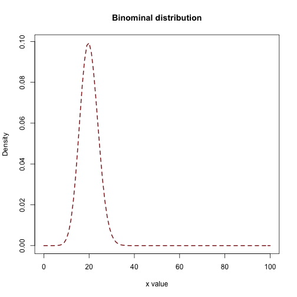


Normal distribution (5/6)
========================================================

$$X \sim Normal(\mu,\sigma^2)$$

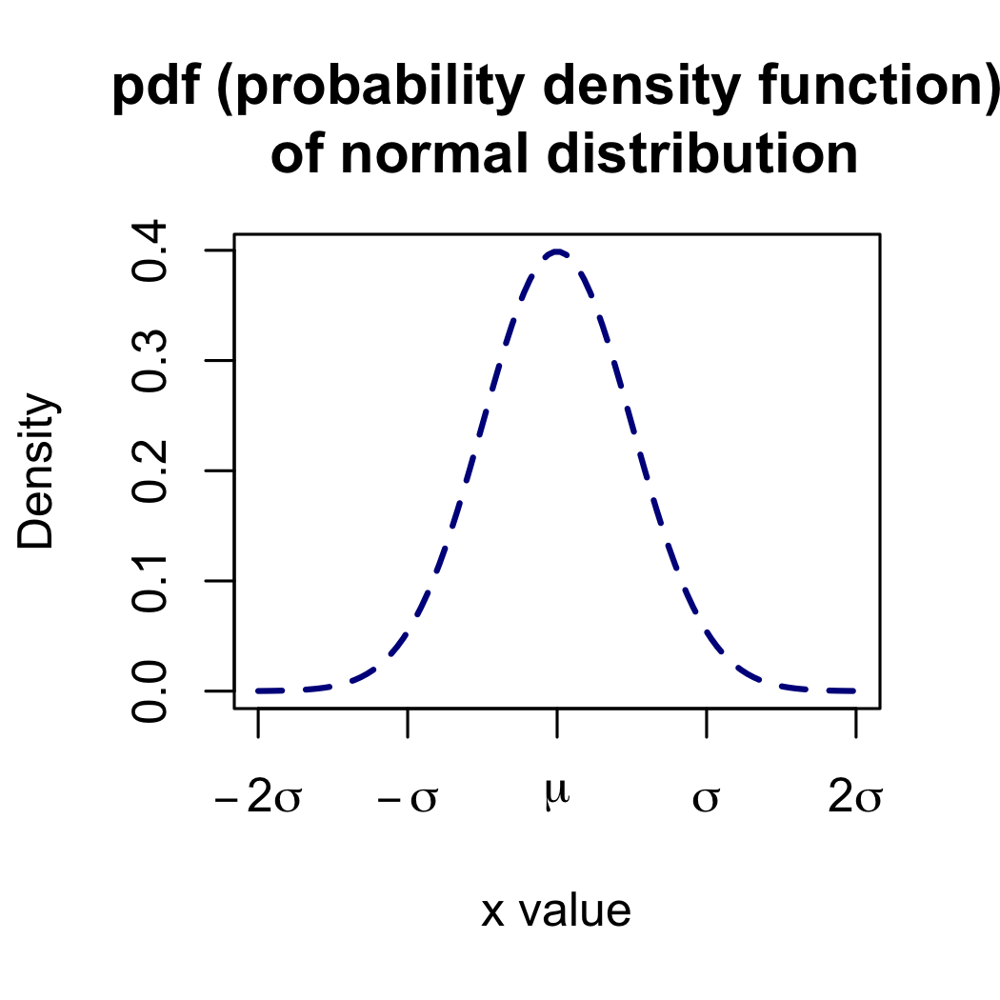

Standard Normal distribution (6/6)
========================================================

$$X \sim Normal(\mu,\sigma^2)$$

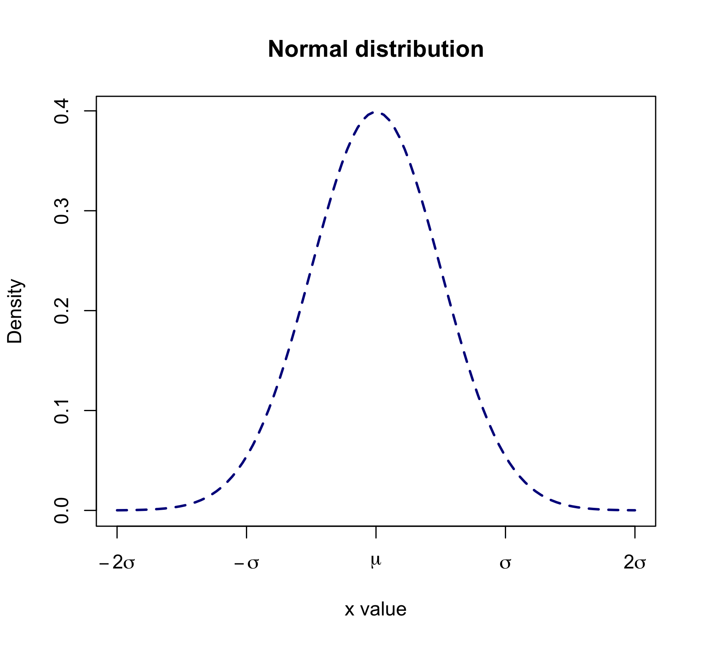
***

Z-score transformation

$$
Z=\frac{X-\mu}\sigma
\\
\\
Z \sim Normal(0,1)
$$

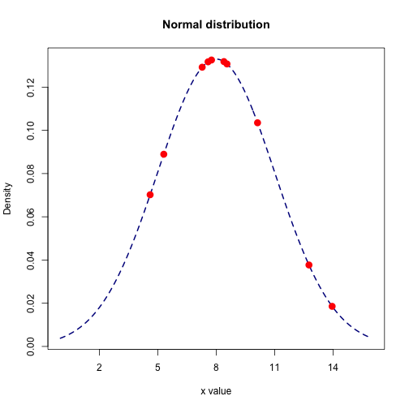

Normal distribution example (1/3)
========================================================

We can use **rnorm()** function to generate random values following a normal distribution. Here we produce 10 normally distributed numeric values with mean 8 and standard deviation of 3


```r
set.seed(2)
rnorm(10,mean=8,sd=3)
```

```
 [1]  5.309256  8.554548 12.763536  4.608873  7.759245  8.397261 10.123864
 [8]  7.280906 13.953422  7.583639
```

If you want to regenerate the exact random numbers, use the **set.seed()** function before generating any random numbers.

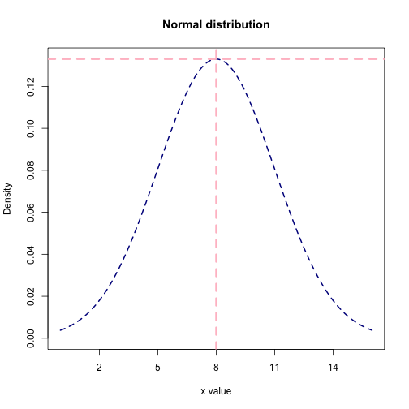


Normal distribution example (2/3)
========================================================
We can also use these functions to interrogate values assuming a normal distribution for the data.

The probablity of a value being exactly 8 for a distribution of mean 8 and standard deviation 3.


```r
dnorm(8,mean=8,sd=3)
```

```
[1] 0.1329808
```

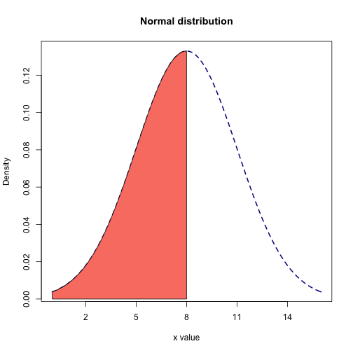

Normal distribution example (3/3)
========================================================
The probablity of a value being less than 8 for a distribution of mean 8 and standard deviation 3.

```r
pnorm(8,mean=8,sd=3)
```

```
[1] 0.5
```


***

The value for which i have a 50 percent being greater than given a normal distribution of mean 8 and standard deviation 3.


```r
qnorm(0.5,mean=8,sd=3)
```

```
[1] 8
```


Time for an exercise!
========================================================

Exercise on this part can be found [here](./exercises/Session1_exercise1.html)


Answers to exercise.
========================================================

Answers can be found [here](./answers/Session1_answers1.html)

R code for solutions can be found here  [here]

