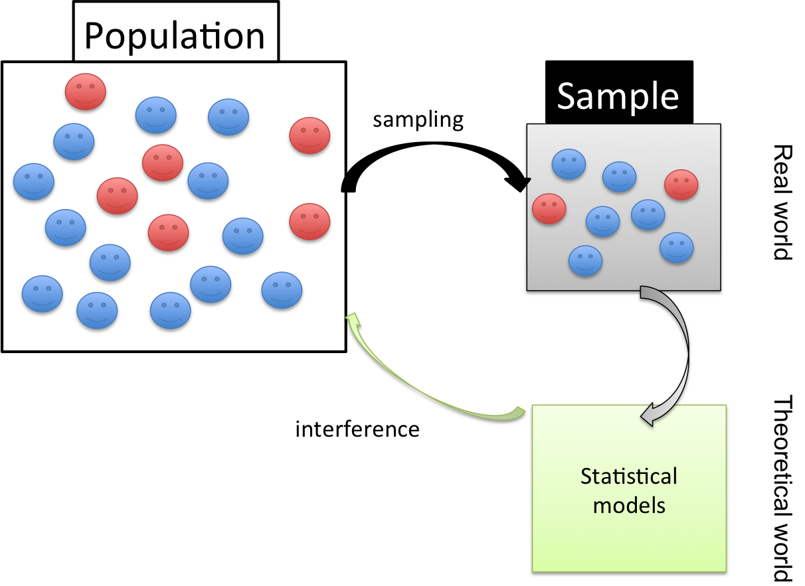
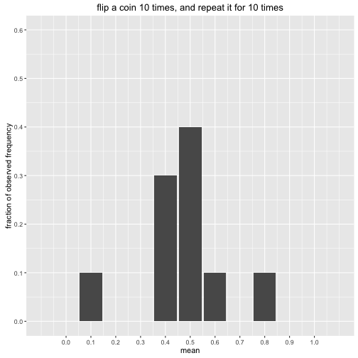
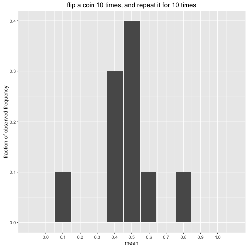
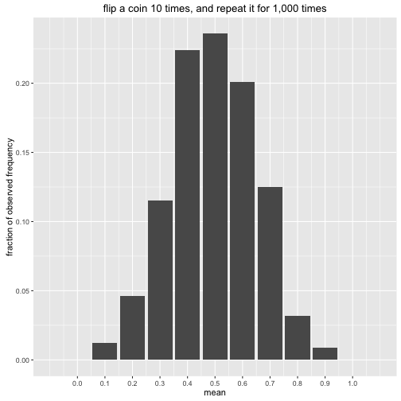

Session2: Hypothesis Testing and ANOVA
========================================================
author: MRC Clinical Sciences Centre (http://mrccsc.github.io/)
date: 12/July/2016
width: 1440
height: 1100
autosize: true
font-import: <link href='http://fonts.googleapis.com/css?family=Slabo+27px' rel='stylesheet' type='text/css'>
font-family: 'Slabo 27px', serif;
css:style.css

Hypothesis testing and ANOVA
========================================================

- SD (standard deviation) and SE (standard error; standard error of sample mean)

- Confidence Interval (CI)

- Hypothesis testing

 -- parametric test:e.g. t-test

 -- non-parametric test: e.g. Wilcoxon test; chi-square test and Fisher's exact test

- Analysis of Variance (ANOVA)


SD and SE (1/7)
========================================================




SD and SE - sampling distribution for the mean (2/7)
========================================================

If we flip a fair coin 10 times, what is the mean of this experiment?

```r
> # always do set.seed() before the random sampling
> set.seed(123)
> # observation number, number of trials and probability of success on each trial
> no.observation=10;
> test1<-rbinom(no.observation,1,0.5)
> test1
```

```
 [1] 0 1 0 1 1 0 1 1 1 0
```

```r
> showmean<-mean(test1)
> showmean
```

```
[1] 0.6
```
***

If we flip a fair coin 10 times ***again***, what is the mean of this experiment?

```r
> test2<-rbinom(no.observation,1,0.5)
> showmean2<-mean(test2)
> showmean2
```

```
[1] 0.5
```


SD and SE - sampling distribution for the mean (3/7)
========================================================

If we flip a fair coin 10 times, what is the mean of this experiment?

```r
> # always do set.seed() before the random sampling
> set.seed(123)
> # observation number, number of trials and probability of success on each trial
> no.observation=10;
> test1<-rbinom(no.observation,1,0.5)
> test1
```

```
 [1] 0 1 0 1 1 0 1 1 1 0
```

```r
> showmean<-mean(test1)
> showmean
```

```
[1] 0.6
```
***

If we flip a fair coin 10 times ***again***, what is the mean of this experiment?

```r
> test2<-rbinom(no.observation,1,0.5)
> showmean2<-mean(test2)
> showmean2
```

```
[1] 0.5
```


SD and SE - sampling distribution for the mean (4/7)
========================================================

What will happen if we repeat this experiment for 10 times, rather than only 2 times

```r
> set.seed(123)
> no.experiment=10
> mat4plot<-matrix(nrow=no.experiment,ncol=1);
> no.observation<-10
> for (i in 1:no.experiment){
+   mat4plot[i,1]<-mean(rbinom(no.observation,1,0.5))
+ }
> hist(mat4plot[,1],xlim=c(0,1),breaks=100,
+      xlab="mean",ylab="observed frequency",
+      main="flip a coin 10 times, and repeat it for 10 times")
```




SD and SE - Central limit theorem (5/7)
========================================================

Flip a coin for 10 times, and repeat it for 100 times


***

Flip a coin for 10 times, and repeat it for 1,000 times


SD and SE - Central limit theorem (C.L.T.) (6/7)
========================================================

Flip a coin for 10 times, and repeat it for 1,000 times


***
$$\text{the sample mean }\overline X\text{ follows an approximate normal distribution}
  \\
  \overline X\approx Normal\left(\mu,\dfrac{\sigma^2}{n}\right)$$

mean of the sampling distribution of the mean

  $$E(\overline X)=\mu_{\overline X}=\mu$$

variance of the sampling distribution of the mean

$$
  Var(\overline X)=\sigma_{\overline X}^2=\frac{\sigma^2}n \text{or }SE^2=\frac{SD^2}n
  \\ \\
  SE=\frac{SD}{\sqrt n}
  \\
$$

***What will happen if we flip a coin for 100 times and repeat it for 1000 times?***


SD and SE - Central limit theorem (C.L.T.) (7/7)
========================================================

Flip a coin for 10 times, and repeat it for 1,000 times


$$
  SE=\frac{SD}{\sqrt{10}}
$$

***

Flip a coin for 100 times and repeat it for 1,000 times


$$
  SE=\frac{SD}{\sqrt{100}}
$$


Confidence Interval for proportions (1/4)
========================================================

- $$
\begin{aligned}
  \text{distribution of }\hat{p}:
\end{aligned}
$$

*Known*

$$
  \begin{aligned}
  E(\hat{p}) = p.
  \\
  Var(\hat{p})=\frac{p(1-p)}n.
  \\

  \text{C.L.T.: approximately: }
  \\
  \hat{p}\approx Normal\left(p,\;\frac{p(1-p)}n\right).
\end{aligned}
$$

*So*

- $$
\begin{aligned}
  \frac{ \hat{p}-p}{\sqrt{\displaystyle\frac{p(1-p)}n}}\approx Normal\left(0,\;1\right).
\end{aligned}
$$

***

$$
\begin{aligned}
  P(\left|\frac{\widehat p-p}{\sqrt{\displaystyle\frac{p(1-p)}n}}\right|>1.96)\approx5\%.
  \\
  P(\left|\frac{\widehat p-p}{\sqrt{\displaystyle\frac{p(1-p)}n}}\right|\leq1.96)\approx95\%.
  \\
  P(p-1.96\sqrt{\frac{p(1-p)}n}\leq\widehat p\leq p+1.96\sqrt{\frac{p(1-p)}n})\approx95\%.
\end{aligned}
$$

- $$\text{95% confidence interval for }\hat{p}$$

$$
\begin{aligned}
  \left[\hat p-1.96\sqrt{\frac{p(1-p)}n},\;\hat p+1.96\sqrt{\frac{p(1-p)}n}\right].
\end{aligned}
$$

- $$\text{p is unknown}$$

***$$\text{substitute }p=\hat{p}$$***

***$$\text{or substitute }p=1/2$$***


Confidence Interval for means (2/4)
========================================================

- $$
\begin{aligned}
  \text{distribution of }\overline X:
\end{aligned}
$$

*Known*

$$
  \begin{aligned}
  E(\overline X) = \mu = \text{true mean}.
  \\
  Var(\overline X)=\frac{\sigma^2}n.
  \\
  \text{C.L.T.: approximately: }
  \\
  \overline X\approx Normal\left(\mu,\;\frac{\sigma^2}n\right).
\end{aligned}
$$

*So*

- $$
\begin{aligned}
  \frac{\overline X-\mu}{\sqrt{\displaystyle\frac{\sigma^2}n}}\approx Normal\left(0,\;1\right).
\end{aligned}
$$

***

$$
\begin{aligned}
  P(\left|\frac{ \overline X-\mu}{\sqrt{\frac{\sigma^2}n}}\right|\leq1.96)\approx95\%.
  \\

  P\left(\overline X-1.96\sqrt{\frac{\sigma^2}n},\;\overline X+1.96\sqrt{\frac{\sigma^2}n}\right)\approx95\%.
\end{aligned}
$$

- $$\text{95% confidence interval for }\overline X$$

$$
\begin{aligned}
  \left[\overline X-1.96\sqrt{\frac{\sigma^2}n},\;\overline X+1.96\sqrt{\frac{\sigma^2}n}\right].
\end{aligned}
$$

- $$\sigma^2\text{ is unknown}$$

*Known*

$$E(S^2)=\sigma^2$$

***$$\text{substitue }\sigma^2=S^2$$***


Confidence Interval for means (3/4)
========================================================

after substitution, rather than having

$$ \frac{\overline X-\mu}{\sqrt{\displaystyle\frac{S^2}n}}\approx Normal\left(0,\;1\right).$$

we have

$$ \frac{\overline X-\mu}{\sqrt{\displaystyle\frac{S^2}n}}\approx t_{n-1}.$$

$$t_{n-1}:\text{t distribution with n-1 degrees of freedom}.$$


Confidence Interval (CI) (4/4)
========================================================

Confidence Interval for proportions

$$
\begin{aligned}
  100(1-\alpha)\%\text{ CI for }\hat{p}:
  \\\\
  \hat{p}\pm z_\frac\alpha2\sqrt{\frac{p(1-p)}n}.
\end{aligned}
$$

***

Confidence Interval for means

$$
\begin{aligned}
  100(1-\alpha)\%\text{ CI for }\overline X:
  \\\\
  \overline X\pm t_\frac\alpha2\frac S{\sqrt n}.
\end{aligned}
$$

Statistical tests
========================================================

On top of descriptive statistics, R has several statistical tests covering a range of problems and data types.

Some common tests include:
- binom.test() - Performs an exact test of a simple null hypothesis about the probability of success in a Bernoulli experiment.
- var.test() - Comparing 2 variances (Fisher's F test)
- t.test() - Comparing 2 sample means with normal errors (Student's t-test)
- wilcox.test() - Comparing 2 means with non-normal errors (Wilcoxon's rank test)
- fisher.test() - Testing for independence of 2 variables in a contingency table (Fisher's exact test)


Hypothesis testing for propotions
========================================================

example: EU referendum result 2016

[data/EU-referendum-result-data.csv]

Did more than 50% percent of the voting UK population support remaining in the EU?

```r
vote.leave=17410742

vote.remain=16141241

total.vote=vote.leave+vote.remain

total.vote
```

```
[1] 33551983
```

```r
vote.leave/total.vote
```

```
[1] 0.5189184
```

CI for the vote for leave
========================================================

The vote for leave is 0.5189184, is it confident? Calculate the 95% CI


```r
alpha.vote=0.05;

phat.vote<-vote.leave/total.vote;

z.vote<-qnorm(alpha.vote/2,
              mean=0,sd=1,
              lower.tail = F)

ME.vote<-z.vote*sqrt(phat.vote*(1-phat.vote)/total.vote)

CI.vote<-phat.vote + c(-ME.vote, ME.vote)

CI.vote
```

```
[1] 0.5187494 0.5190875
```
***

Use the *binom.confint()* from **binom** package


```
Error in library("binom") : there is no package called 'binom'
```
